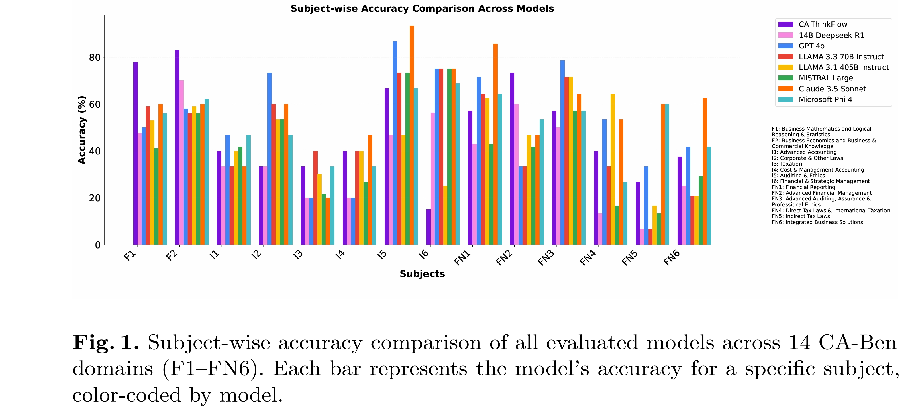
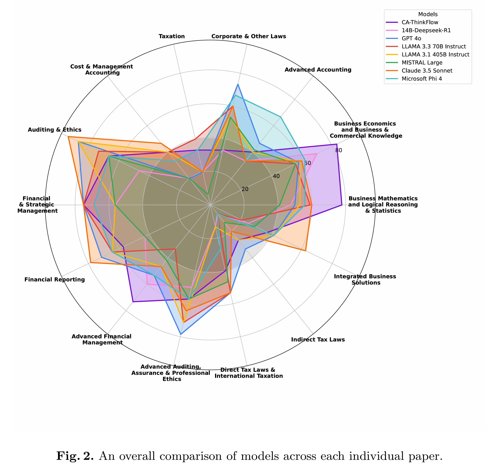

# CA-ThinkFlow: Retrieval-Augmented Reasoning for Chartered Accountancy

**CA-ThinkFlow** is a parameter-efficient Retrieval-Augmented Generation (RAG) framework designed to solve complex financial and legal queries from the Indian Chartered Accountancy (CA) domain. By combining the reasoning power of a quantized **DeepSeek-R1-14B** model with high-fidelity document parsing via **Docling**, CA-ThinkFlow achieves state-of-the-art reliability on the CA-Ben benchmark.

## 🚀 Key Features
* **Reasoning-First RAG:** Uses the intrinsic Chain-of-Thought (CoT) of DeepSeek-R1 to synthesize context without needing complex logic gates or similarity thresholds.
* **Layout-Aware Extraction:** Leverages **Docling** to preserve complex tables and mathematical formulas from dense ICAI study materials.
* **Quantized Efficiency:** Optimized for 4-bit (Q4_K_M) execution, making high-level financial reasoning accessible on consumer-grade hardware.
* **Standardized Evaluation:** Fully compatible with the **CA-Ben** benchmark methodology, system prompts, and regex-based extraction.

---

## 🛠️ System Architecture
1.  **Ingestion:** Official ICAI Study Materials are parsed into Markdown using Docling.
2.  **Indexing:** Text chunks are embedded using `Qwen-Embedding-0.6B` and stored in a FAISS vector index.
3.  **Inference:** Queries trigger a top-1 ($k=1$) retrieval, which is injected directly into a standardized prompt template.
4.  **Generation:** DeepSeek-R1 processes the query and retrieved context at a 0.75 temperature setting to produce a grounded, interpretible answer.

---

## 📁 Repository Structure

├── data/               # Scripts for downloading ICAI modules and PDF storage
├── indexing/           # Docling parsing and FAISS index creation scripts
├── src/                # Core RAG pipeline, prompt templates, and model inference
├── evaluation/         # CA-Ben benchmark scripts and regex extractors
└── requirements.txt    # Dependencies (LangChain, Ollama, Docling, FAISS, etc.)


---

## 🚦 Getting Started

### 1. Prerequisites

* Python 3.11+
* [Ollama](https://ollama.ai/) (for running DeepSeek-R1-Distill-Qwen-14B)
* NVIDIA GPU (Recommended 12GB+ VRAM for Q4_K_M)

### 2. Installation

```bash
git clone [https://github.com/YourUsername/CA-ThinkFlow.git](https://github.com/YourUsername/CA-ThinkFlow.git)
cd CA-ThinkFlow
pip install -r requirements.txt

```

### 3. Usage

To run a query through the CA-ThinkFlow pipeline:

```bash
python main.py --query "Define the criteria for a Small Company under the Companies Act 2013."

```

---

## 📊 Results

### Performance Overview

CA-ThinkFlow achieves a **Scholastic Reliability Coefficient (SRC) of 68.75%**, matching the performance of much larger proprietary models like GPT-4o and Claude 3.5 Sonnet on the CA-Ben benchmark.

### Subject-wise Breakdown



### Model-wise Accuracy



### Systemic Bottlenecks

Systems Bottlenecks still exists in exams like Taxation (I3) and Indirect Tax Laws (FN5) where all models, including CA-ThinkFlow, did'nt passed the 40% threshold.

---

## 📝 Citation

If you use this work in your research, please cite our paper:

```bibtex
@misc{Gupta2026CAThinkflow,
  title={Retrieval-Augmented Reasoning for Chartered Accountancy},
  author={Jatin Gupta and Akhil Sharma and Saransh Singhania and Ali Imam Abidi},
  year={2025},
  journal={GitHub Repository},
}
```
```bibtex
@article{Gupta2025CABen,
  author    = {Gupta, Jatin and Sharma, Akhil and Singhania, Saransh and Adnan, Mohammad and Deo, Sakshi and Abidi, Ali Imam and Gupta, Keshav},
  title     = {Large Language Models Acing Chartered Accountancy},
  journal   = {SN Computer Science},
  year      = {2025},
  volume    = {6},
  number    = {8},
  pages     = {957},
  doi       = {10.1007/s42979-025-04497-x},
  url       = {https://doi.org/10.1007/s42979-025-04497-x},
  issn      = {2661-8907}
}
```
